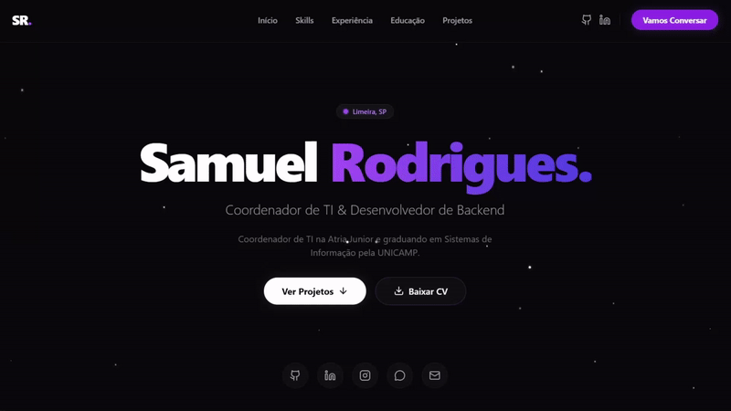

# 💻 My Portfolio | Software Engineer & IT Coordinator

Este repositório contém o código-fonte do meu portfólio pessoal. O objetivo é centralizar a minha trajetória profissional, projetos técnicos e competências em uma interface moderna, rápida e responsiva.

## 🚀 Tecnologias Utilizadas

- **Frontend:** React, Next.js, TypeScript e Tailwind CSS.
- **Animações:** Framer Motion.
- **Deployment:** Vercel.
- **Ícones:** DevIcons e Lucide React.

## 📸 Demonstração

### Vídeo / GIF de Apresentação

## ✨ Funcionalidades

- **Experiência Profissional Dinâmica:** Seção alimentada por objetos de configuração (facilitando a manutenção).
- **Responsividade Total:** Focado em Mobile First.
- **Integração com EmailJS API:** implementação de envio de emails via formulário utilizando JavaScript no frontend.
